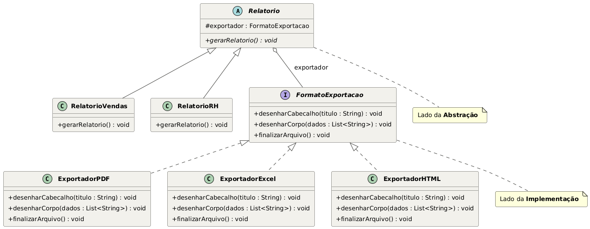
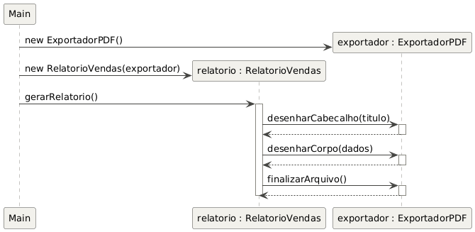

# Módulo de Relatórios — Padrão Bridge

Projeto da disciplina, FASE 2: implementação em **Java** do padrão de projeto
**Bridge**, aplicado à expansão do módulo de relatórios do sistema de BI da
TechFatec.

## O problema

O sistema legado só sabia gerar o **Relatório de Vendas** em **PDF**. O novo
requisito pede:

- Um novo tipo de relatório: **Relatório de Desempenho de RH**;
- Todos os relatórios (atuais e futuros) exportáveis em **PDF**, **Excel** e
  **HTML**.

Resolver isso criando uma subclasse para cada combinação
(`RelatorioVendasPDF`, `RelatorioVendasExcel`, `RelatorioRHHTML`, ...) causaria
uma explosão combinatória de classes a cada novo tipo de relatório ou formato.
O padrão **Bridge** resolve isso separando duas hierarquias que variam de
forma independente:

- **Abstração** — *o que* é gerado (o tipo de relatório);
- **Implementação** — *como* o conteúdo é desenhado (o formato de exportação).

A Abstração guarda apenas uma referência à interface de Implementação — a
"ponte" — em vez de conhecer qualquer classe concreta.

## Diagrama de classes



- **Lado da Abstração**: `Relatorio` (abstrata) e suas refinadas
  `RelatorioVendas` e `RelatorioRH`.
- **Lado da Implementação**: a interface `FormatoExportacao` e seus
  implementadores concretos `ExportadorPDF`, `ExportadorExcel` e
  `ExportadorHTML`.
- `Relatorio` mantém a associação `exportador : FormatoExportacao` — é essa
  referência que forma a ponte entre os dois lados.

## Diagrama de sequência



O fluxo básico: o Cliente instancia um exportador concreto, injeta-o num
relatório e chama `gerarRelatorio()`. Internamente, o relatório delega o
trabalho de desenho para o exportador, chamando em ordem
`desenharCabecalho()`, `desenharCorpo()` e `finalizarArquivo()` — sem nunca
saber qual formato concreto está por trás da interface.

## Estrutura de diretórios

```
bridge-pattern/
├── README.md
├── diagramas/
│   ├── diagrama-de-classes-bridge.png
│   └── diagrama-de-sequencia-bridge.png
└── src/
    ├── abstracao/
    │   ├── Relatorio.java          (abstrata)
    │   ├── RelatorioVendas.java
    │   └── RelatorioRH.java
    ├── implementacao/
    │   ├── FormatoExportacao.java  (interface)
    │   ├── ExportadorPDF.java
    │   ├── ExportadorExcel.java
    │   └── ExportadorHTML.java
    └── cliente/
        └── Main.java
```

## Injeção de dependência

Nenhuma classe de `abstracao` instancia um exportador concreto com `new`.
`Relatorio` recebe a implementação pronta pelo construtor:

```java
protected Relatorio(FormatoExportacao exportador) {
    this.exportador = exportador;
}
```

Quem decide qual `ExportadorXxx` usar é sempre o **Cliente**
(`cliente.Main`), o que mantém a Abstração completamente desacoplada da
Implementação.

## Aderência ao Princípio Aberto/Fechado (OCP)

- Para adicionar o **Relatório de RH**, criou-se `RelatorioRH extends
  Relatorio` — nenhuma linha das classes de exportação foi tocada.
- Para adicionar um formato novo (por exemplo, `ExportadorCSV`), basta
  implementar `FormatoExportacao` — nenhuma classe de relatório precisa
  mudar.

O sistema fica **aberto para extensão** (novos relatórios e novos formatos) e
**fechado para modificação** (o código existente não precisa ser alterado).

## Script de validação (`cliente.Main`)

`Main` simula as três rotinas exigidas:

1. Gera o Relatório de Vendas em PDF.
2. Troca o exportador do **mesmo objeto** `relatorioVendas`, em tempo de
   execução, para Excel, via `setExportador(...)`, e gera novamente — sem
   recriar o relatório.
3. Gera o Relatório de RH em HTML.

### Como compilar e executar

```bash
cd src
javac -d ../bin abstracao/*.java implementacao/*.java cliente/*.java
java -cp ../bin cliente.Main
```

### Saída esperada (resumida)

```
=== Rotina 1: Relatório de Vendas em PDF ===
[PDF] Cabeçalho gerado com fonte serifada -> Relatório de Vendas - Setembro/2026
...
=== Rotina 2: Mesmo relatório de Vendas, trocado em tempo de execução para Excel ===
[EXCEL] Célula A1 mesclada e em negrito -> Relatório de Vendas - Setembro/2026
...
=== Rotina 3: Relatório de RH em HTML ===
[HTML] <h1>Relatório de Desempenho de RH - Setembro/2026</h1>
...
```

O fato de a Rotina 2 reaproveitar o mesmo objeto `relatorioVendas` e apenas
trocar o formato de saída é a prova prática do desacoplamento promovido pelo
Bridge.
